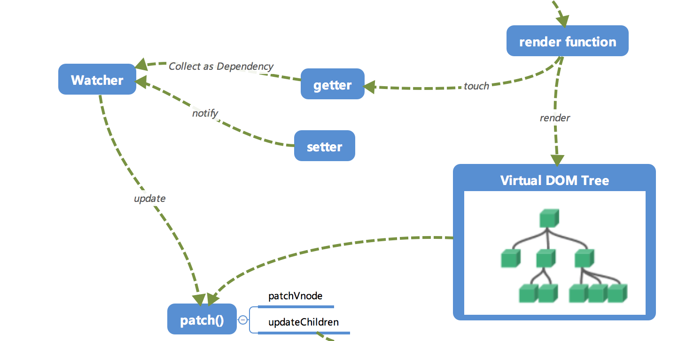
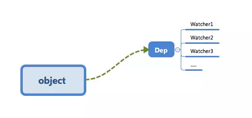

## Vue.js 运行机制全局概览


### **初始化及挂载**

new Vue()之后，Vue 会调用\_init 函数进行初始化，在这个过程中会初始化生命周期、_事件_、props、methods、data、computed 与 watch；最重要的是通过 Object.defineProperty 设置 setter 与 getter 函数，用来实现**响应式**以及**依赖收集**，初始化后会调用$mount 挂载组件，如果是*运行时编译*，即不存在 render function 但是存在 template 的情况，需要进行**编译**步骤

### **编译**

三个阶段，并最终需要得到 render function：

parse：解析 template 模板中的指令，class、style 等数据，形成*AST*

> AST:抽象语法树

optimize：标记 static 静态节点，这是 Vue 编译过程中的一处优化，后面当 update 更新界面时，会有一个 patch 的过程，*diff 算法*会直接跳过静态节点，从而减少了比较的过程优化了 patch 的性能  
generate： 是将 AST 转化成 render function 字符串的过程，得到 render 字符串以及 staticRecderFns 字符串

### 响应式


getter 与 setter 在 init 的时候通过 Object.defineProperty 进行了绑定，使得被设置的对象在被读取的时候会执行 getter 函数，赋值的时候会执行 setter 函数

当 render function 呗渲染的时候，因为会读取所需对象的值，所以会触发 getter 函数进行*依赖收集*，其目的是将观察者 Watcher 对象存放到当前必报中的订阅者 Dep 的 subs 中：

在修改对象的值的时候，会触发相应的 setter，setter 通知之前依赖收集得到的 Dep 中的每一个 Watcher 调用 update 重新渲染试图

### Virtual DOM

render function 会被转化成 VNode 节点。Virtual DOM 实际上是一棵以 Javascript 对象（VNode 节点）作为基础的树，用对象属性来描述节点，最终将其映射到真实环境中，所以 Virtual DOM 具有跨平台的能力：

```javascript
{
   tag: 'div',                 /*说明这是一个div标签*/
   children: [                 /*存放该标签的子节点*/
       {
           tag: 'a',           /*说明这是一个a标签*/
           text: 'click me'    /*标签的内容*/
       }
   ]
}
```

选然后可以得到：

```html
<div>
    <a>click me</a>
</div>
```

### 更新试图

当数据变化时，执行 render function 会得到一个新的 VNode 节点，然后将新的节点与旧的节点一起传入 path 中进行比较，经过 diff 算法得出**差异**。最后只要将这些差异的对应 DOM 进行修改即可
